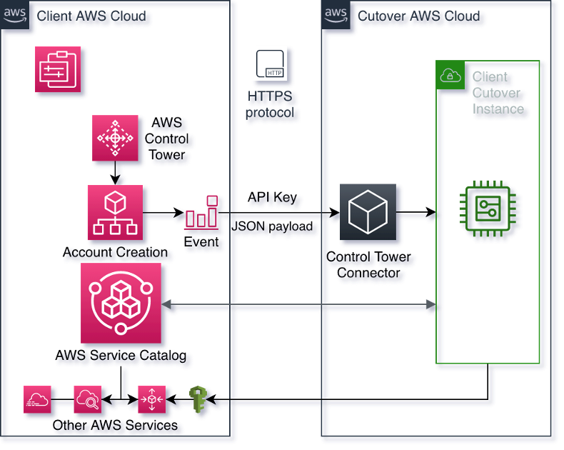

# Integrating Cutover with AWS Control Tower for <>

AWS Control Tower Lifecyle Integration with Cutover allows new AWS accounts created to be automatically added to your Cutover environment and enable you to <>

## How it Works

Using an automated setup will setup the following components in your AWS management account:

* An AWS Secrets Manager Secret containing your Cutover keys and configuration
* An Integration StackSet that will be used for creating the required permissions in Control Tower managed accounts
* A CloudWatch Events Rule to trigger off Control Tower Lifecycle Events
* A Lambda function along with an IAM Role to handle the Lifecycle Event and interact with the Cutover API

## Solution Design

## How to Setup

**INSERT FROM DOCS**

## How to Test

**INSERT FROM DOCS**
